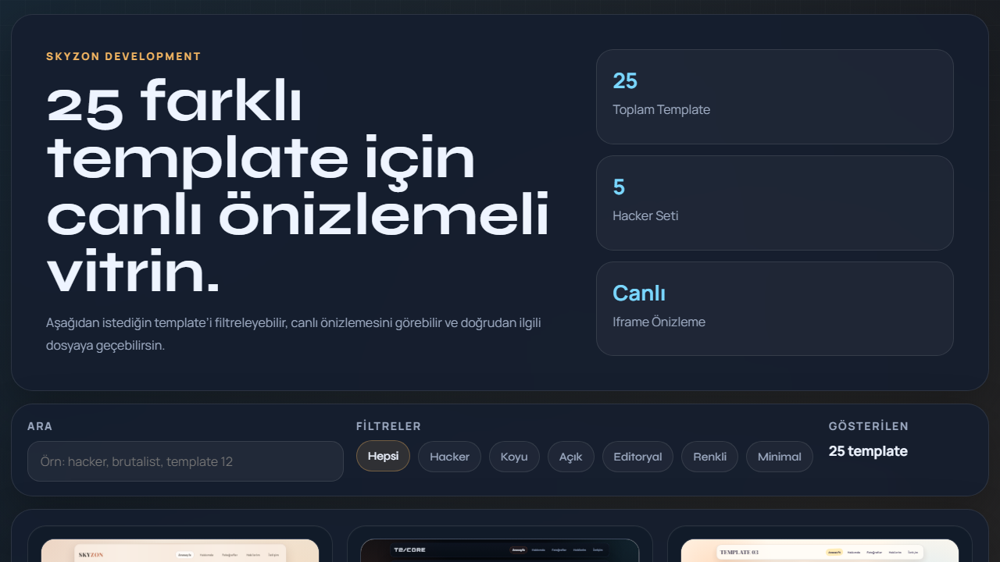

# Skyzon Template Vault

English README: [README.md](README.md)

Bu depo, HTML, CSS ve bazi kisimlarda JavaScript ile hazirlanmis statik bir vitrin sayfasi ile birlikte 25 adet kisisel web sitesi template'i icerir.



## Genel Bakis

- Canli onizlemeli kok vitrin anasayfasi
- Birbirinden bagimsiz 25 adet cok sayfali template
- Her template icinde su sayfalar bulunur:
  - `index.html`
  - `hakkimda.html`
  - `fotograflar.html`
  - `hobilerim.html`
  - `iletisim.html`
- Her template icin ayri `style.css`
- `template-21` ile `template-25` arasindaki hacker temalarinda ek `script.js` efektleri
- `previews/` klasoru icinde uretilmis onizleme gorselleri

## Kok Vitrin

Kok dizindeki dosyalar onizleme sistemini calistirir:

- `index.html`: ana galeri sayfasi
- `style.css`: vitrin tasarimi
- `script.js`: arama, filtre ve canli iframe onizleme mantigi

Kullanici bu sayfa uzerinden template'leri filtreleyebilir, arayabilir ve istedigi tasarimi dogrudan acabilir.

## Proje Yapisi

```text
.
|-- .github/
|-- index.html
|-- previews/
|-- style.css
|-- script.js
|-- template-1
|-- template-2
|-- ...
|-- template-25
|-- CHANGELOG.md
|-- release-notes-v1.0.0.md
`-- README.md
```

## GitHub Icin Hazir Dosyalar

- Yerel gecici dosyalar ve arsiv ciktilari icin `.gitignore`
- GitHub Pages yayini icin `.github/workflows/deploy-pages.yml`
- `v*` tagleri ile otomatik zip release icin `.github/workflows/release-package.yml`
- Repo vitrin gorselleri icin `previews/`
- Surum dokumani icin `CHANGELOG.md` ve `release-notes-v1.0.0.md`

## Kullanim

1. Vitrini gormek icin kokteki `index.html` dosyasini ac.
2. Kartlar uzerinden template'leri incele ve `Ac` veya `Yeni Sekme` ile ilgili tasarima git.
3. Istersen belirli bir template klasorune girip o tasarim uzerinde dogrudan duzenleme yap.

En sorunsuz onizleme icin projeyi sadece `file://` ile acmak yerine lokal sunucu uzerinden calistirman daha iyi olur.

Ornek:

```bash
python -m http.server 8000
```

Ardindan su adresi ac:

```text
http://localhost:8000
```

## GitHub Pages ile Yayinlama

Bu proje tamamen statik ve GitHub Pages workflow dosyasi hazir durumda.

1. Depoyu GitHub'a gonder.
2. Varsayilan branch olarak `main` veya `master` kullan.
3. `Settings > Pages` icinde GitHub sorarsa kaynak olarak `GitHub Actions` sec.
4. Varsayilan branch'e push yap.
5. `Deploy GitHub Pages` workflow'unun bitmesini bekle.

Kokteki `index.html`, projenin anasayfasi olarak calisacaktir.

## Onizleme Dosyalari

- `previews/showcase-home.png` kok vitrin ekran goruntusunu icerir.
- `previews/overview-grid.png` tum 25 template icin toplu bir gorunum sunar.
- `previews/template-1-home.png` ile `previews/template-25-home.png` arasinda tekil ekran goruntuleri vardir.

## Ilk Release

- Yerel release paketi: `release-assets/skyzon-template-vault-v1.0.0.zip`
- SHA256 ozeti: `release-assets/SHA256SUMS.txt`
- Release notu: `release-notes-v1.0.0.md`

Sonraki GitHub release'leri icin `v1.0.0` gibi bir tag olusturup push etmen yeterli. `Build Release Package` workflow'u zip dosyasini otomatik uretecektir.

## Notlar

- Template'lerin hepsi birbirinden bagimsizdir.
- Hacker temalarinda JavaScript animasyonlari bulunur.
- Kod dosyalarinin icinde istek uzerine `SKYZON DEVELOPMENT` aciklama satirlari yer alir.
